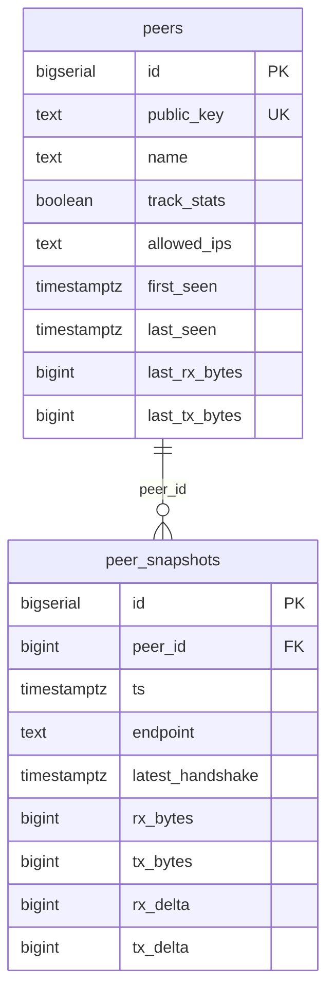

# log-awg — план реализации

Сборщик активности пиров AmneziaWG: раз в минуту читает `awg show <iface> dump`,
парсит и пишет снапшот в Postgres.

## 1. Источник данных

Использовать **`awg show <iface> dump`**, а не человекочитаемый вывод.

Пример человекочитаемого вывода (для справки, НЕ парсить):

```
peer: 7NkempR9bOMreg7YcaEtSgXpDV7HxY0CNvnBpv4Ueg0=
  endpoint: 31.173.85.112:4409
  allowed ips: 10.12.0.9/32
  latest handshake: 1 minute, 34 seconds ago
  transfer: 1.37 GiB received, 13.07 GiB sent
```

Проблемы этого формата: округлённое "уезжающее" время (`1 minute, 34 seconds ago` уже
неверно к моменту парсинга), округлённые единицы трафика (GiB), нестабильный для regex
формат, лишние поля интерфейса (jc/jmin/jmax/s1/s2/h1-h4), которые не нужны.

Формат `dump` — tab-separated, стабильный:

```
<строка 0, интерфейс>: private-key  public-key  listen-port  fwmark
<строка N, пир>:       public-key  preshared-key  endpoint  allowed-ips  latest-handshake(unix)  rx-bytes  tx-bytes  persistent-keepalive
```

Правила парсинга:
- строка 0 (интерфейс) — пропускается целиком, private-key нам не нужен;
- пустой `endpoint` / `allowed-ips` → приходит как `(none)`;
- `latest-handshake == 0` → пир никогда не коннектился (в примере с сервера это
  `TXlMvhMfx1y4jxz5FoE2H8+jh5dRLNJ0PLq9r2YgR3o=` и `FU+TzOQbkz/Zn+OR3t3foDyj1V9t+X2H9tFLYKnh7w4=`,
  у них нет `endpoint`/`transfer` в текстовом выводе) — такие пиры **не пишем** в
  таблицу снапшотов (условие "чекать только активные");
- `rx-bytes`/`tx-bytes` — точные значения в байтах, аккумулируются с момента поднятия
  интерфейса (не дельты).

## 2. Права доступа

`awg show` без привилегий — `Permission denied`. Коллектор должен работать от root
(это read-only чтение состояния интерфейса через netlink, ничего опасного). Проще
всего — процесс-менеджер (supervisor) запускает его сразу от `root`, без
sudoers и setcap.

## 3. Стек для работы с БД

Выбран набор **pgx + sqlc + golang-migrate**:

- **[pgx/v5](https://github.com/jackc/pgx)** — самый популярный low-level
  Postgres-драйвер для Go (быстрее `database/sql` + `lib/pq`, нативная поддержка
  batch/pool). Используется через `pgxpool.Pool`.
- **[sqlc](https://sqlc.dev)** — генерирует типобезопасный Go-код прямо из
  обычных SQL-запросов (`db/queries.sql`). Никакой ORM-магии и рефлексии в
  рантайме, весь SQL виден и проверяем глазами, ошибки в схеме ловятся на этапе
  `sqlc generate`, а не в проде. Хорошо подходит для проекта с небольшим,
  фиксированным набором запросов (upsert пира, insert снапшота, выборки).
- **[golang-migrate](https://github.com/golang-migrate/migrate)** — самый
  популярный инструмент миграций для Go, CLI + библиотека, `.up.sql`/`.down.sql`
  файлы, версионирование схемы в самой БД (таблица `schema_migrations`).

Почему не GORM: это полноценная ORM с рефлексией, hook'ами, lazy-loading —
избыточно для сервиса с двумя таблицами и тремя типами запросов (upsert peer,
insert snapshot, редкие выборки для отчётов). sqlc даёт типобезопасность GORM
без её рантайм-накладных расходов и "магии".

## 4. Схема Postgres



`db/migrations/0001_init.up.sql`:
```sql
CREATE TABLE peers (
    id             BIGSERIAL PRIMARY KEY,
    public_key     TEXT NOT NULL UNIQUE,
    name           TEXT,                       -- опциональный человекочитаемый комментарий
    track_stats    BOOLEAN NOT NULL DEFAULT TRUE, -- false = не писать peer_snapshots для этого пира
    first_seen     TIMESTAMPTZ NOT NULL DEFAULT now(),
    last_seen      TIMESTAMPTZ NOT NULL DEFAULT now(),
    last_rx_bytes  BIGINT NOT NULL DEFAULT 0,   -- для расчёта дельты между опросами
    last_tx_bytes  BIGINT NOT NULL DEFAULT 0
);

CREATE TABLE peer_snapshots (
    id                BIGSERIAL PRIMARY KEY,
    peer_id           BIGINT NOT NULL REFERENCES peers(id) ON DELETE CASCADE,
    ts                TIMESTAMPTZ NOT NULL DEFAULT now(),
    endpoint          TEXT,
    latest_handshake  TIMESTAMPTZ NOT NULL,
    rx_bytes          BIGINT NOT NULL,   -- сырое значение счётчика на момент опроса
    tx_bytes          BIGINT NOT NULL,
    rx_delta          BIGINT NOT NULL,   -- прирост с прошлого снапшота
    tx_delta          BIGINT NOT NULL
);

CREATE INDEX peer_snapshots_peer_ts_idx ON peer_snapshots (peer_id, ts DESC);
CREATE INDEX peer_snapshots_ts_idx ON peer_snapshots (ts);
```

`db/migrations/0002_peer_allowed_ips.up.sql` (внутренний VPN-адрес пира,
`10.12.0.x/32` из allowed-ips дампа; статичен per-пир, поэтому в `peers`, а
не дублируется в каждой строке `peer_snapshots`; несколько CIDR через запятую,
как в самом dump-выводе):
```sql
ALTER TABLE peers ADD COLUMN allowed_ips TEXT NOT NULL DEFAULT '';
```

`db/migrations/0001_init.down.sql`:
```sql
DROP TABLE peer_snapshots;
DROP TABLE peers;
```

**`track_stats`** — ручной флаг по каждому пиру. По умолчанию `true` (новый пир
из дампа автоматически заводится в `peers` и учитывается). Если для пира выставили
`track_stats = false` (например `UPDATE peers SET track_stats = false WHERE public_key = '...'`,
либо запрос `SetPeerTracking` из раздела 5) — коллектор продолжает видеть его в
дампе и обновлять `peers.last_seen`/счётчики, но **строка в `peer_snapshots` для
него не пишется**. Итоговое условие записи снапшота: `track_stats = true AND
latest_handshake != 0` (пир одновременно должен быть отслеживаемым и хотя бы раз
подключался).

Расчёт дельты трафика в коллекторе (не в SQL), при записи снапшота:

```
if new_rx < last_rx:      # интерфейс/пир пересоздан, счётчик обнулился
    rx_delta = new_rx
else:
    rx_delta = new_rx - last_rx
```
(аналогично для tx). После расчёта `peers.last_rx_bytes/last_tx_bytes` обновляются
новыми значениями.

Онлайн/офлайн пира — вычисляемое поле, не хранится:
```sql
SELECT *, (now() - latest_handshake < interval '3 minutes') AS is_online
FROM peer_snapshots ...
```

## 5. sqlc-запросы

`db/queries.sql` (аннотации `-- name:` — это то, из чего sqlc генерирует функции):

```sql
-- name: UpsertPeer :one
INSERT INTO peers (public_key, allowed_ips, first_seen, last_seen)
VALUES ($1, $2, now(), now())
ON CONFLICT (public_key) DO UPDATE SET last_seen = now(), allowed_ips = $2
RETURNING id, track_stats, last_rx_bytes, last_tx_bytes;

-- name: UpdatePeerCounters :exec
UPDATE peers SET last_rx_bytes = $2, last_tx_bytes = $3 WHERE id = $1;

-- name: InsertSnapshot :exec
INSERT INTO peer_snapshots
    (peer_id, ts, endpoint, latest_handshake, rx_bytes, tx_bytes, rx_delta, tx_delta)
VALUES ($1, $2, $3, $4, $5, $6, $7, $8);

-- name: SetPeerTracking :exec
-- Включить/выключить запись статистики для пира вручную.
UPDATE peers SET track_stats = $2 WHERE public_key = $1;
```

`sqlc.yaml`:
```yaml
version: "2"
sql:
  - engine: "postgresql"
    queries: "db/queries.sql"
    schema: "db/migrations"
    gen:
      go:
        package: "sqlcgen"
        out: "internal/sqlcgen"
        sql_package: "pgx/v5"
```

`sqlc generate` кладёт готовые типобезопасные функции (`UpsertPeer`, `UpdatePeerCounters`,
`InsertSnapshot`) и структуры в `internal/sqlcgen` — этот код в репозитории коммитится,
регенерируется при изменении `db/queries.sql`/`db/migrations`.

## 6. Рост таблицы и retention

Раз в минуту × N активных пиров. Для 20-50 активных пиров — 30-70 тыс. строк/сутки.
Варианты (выбрать по месту):
- если можно ставить расширения — TimescaleDB hypertable + retention policy
  (например хранить сырые снапшоты 30 дней, дальше агрегаты по часам);
- иначе — обычная таблица + периодический `DELETE FROM peer_snapshots WHERE ts < now() - interval '30 days'`
  отдельной cron-джобой (раз в сутки).

## 7. Структура Go-проекта

```
log-awg/
  go.mod
  cmd/log-awg/main.go        — точка входа демона: setup → loop → graceful shutdown
  internal/awg/dump.go       — exec awg show dump + парсинг в []Peer
  internal/awg/dump_test.go  — тесты парсера на реальных примерах вывода
  internal/store/store.go    — обёртка над sqlcgen.Queries: транзакция upsert+delta+insert
  internal/sqlcgen/          — сгенерированный sqlc-код (не редактируется руками)
  db/queries.sql             — исходные SQL-запросы для sqlc
  db/migrations/0001_init.up.sql
  db/migrations/0001_init.down.sql
  sqlc.yaml                  — конфиг генератора sqlc
  deploy/log-awg.conf        — supervisor program config, user=root, autorestart=true
  deploy/env.example         — пример /var/www/log-awg/env
```

Конфигурация через переменные окружения:
- `AWG_INTERFACE` (default `awg0`)
- `AWG_BIN` (default `awg`)
- `DATABASE_URL` (обязательна, `postgres://...`)
- `AWG_EXEC_TIMEOUT` (default `5s`)
- `AWG_POLL_INTERVAL` (default `1m`)

## 8. Демон: самокорректирующийся цикл, не `time.Ticker`

`log-awg` — долгоживущий процесс, поднятый под supervisor одним `[program:log-awg]`
(без отдельного таймера/крона на сам запуск). Внутри — пул соединений к Postgres,
поднятый один раз при старте (переиспользуется между тиками, не пересоздаётся
каждую минуту).

Планирование тика — **не** `time.NewTicker(60*time.Second)` напрямую: обычный
Ticker дрейфует (время каждого тика — это "60с после предыдущего", а не точная
граница минуты, и если один прогон подвиснет, тики начнут копиться). Вместо этого
на каждой итерации явно считаем время до следующей границы интервала:

```go
for {
    now := time.Now()
    next := now.Truncate(pollInterval).Add(pollInterval)
    select {
    case <-time.After(next.Sub(now)):
        runOnce(ctx) // exec awg show dump → parse → save
    case <-ctx.Done():
        return
    }
}
```

Это одновременно даёт защиту от наложения тиков: цикл строго последовательный,
следующая итерация не начнётся, пока не завершится `runOnce`. Если `runOnce`
случайно займёт больше интервала — следующий тик просто наступит сразу же
(`next.Sub(now)` окажется в прошлом → `time.After` сработает мгновенно), без
параллельного запуска второго прогона поверх первого.

Graceful shutdown — через `signal.NotifyContext(context.Background(), syscall.SIGINT, syscall.SIGTERM)`:
по сигналу `ctx` отменяется, текущий `runOnce` (если идёт) должен завершиться по
своему собственному таймауту (`AWG_EXEC_TIMEOUT` для exec + отдельный таймаут на
запись в БД), цикл выходит без начала нового тика. `supervisorctl stop/restart`
шлёт `SIGTERM` (`stopsignal=TERM`), так что это укладывается в тот же путь.

Всё, что относится к приложению на хосте, лежит в одном каталоге —
`/var/www/log-awg` (репозиторий, бинарник `log-awg`, `env`, `migrations/`).
Несмотря на путь `/var/www`, раздавать его веб-сервером не нужно — там лежит
пароль от БД (`env`), который к тому же не должен быть читаем от `www-data`
(владельца остального каталога, нужен ему для `git pull`/`go build`) — только
от `root`, поэтому `env` кладётся `chmod 600 root:root` отдельно.

Программа под supervisor не может напрямую прочитать `EnvironmentFile`, как
это умеет systemd, поэтому `command` — обёртка на `sh -c`, которая сначала
подтягивает `env`, потом делает `exec` в сам бинарник (секрет в файл конфига
supervisor не попадает). `set -a` перед `.` обязателен: обычный `. env` только
задаёт переменные в текущем шелле, не экспортирует их — без `set -a` `exec`
передаст бинарнику пустое окружение, и `os.Getenv("DATABASE_URL")` в Go
вернёт пустую строку, даже если в `env` всё написано верно.

`deploy/log-awg.conf` (→ `/etc/supervisor/conf.d/log-awg.conf`):
```ini
[program:log-awg]
command=/bin/sh -c 'set -a; . /var/www/log-awg/env; set +a; exec /var/www/log-awg/log-awg'
directory=/var/www/log-awg
user=root
autostart=true
autorestart=true
startsecs=3
startretries=10
stopsignal=TERM
stopwaitsecs=15
stdout_logfile=/var/log/log-awg.out.log
stderr_logfile=/var/log/log-awg.err.log
```

`migrate`/`sqlc generate` запускаются отдельно, вручную/при деплое схемы — не
внутри рантайма демона. Автоматизация всего этого (git pull, сборка, миграции,
`supervisorctl restart`) — в `deploy.sh` в корне репозитория, запускается прямо
на сервере.

## 9. Обработка ошибок

Ключевое отличие демона от одноразового прогона: транзиентная ошибка **не должна
убивать процесс** — она должна залогироваться, и демон должен дожить до
следующего тика и попробовать снова.

- `awg show` вернул ошибку (интерфейс не поднят, permission denied) → залогировать,
  пропустить этот тик, продолжить цикл (не выходить из процесса);
- ошибка парсинга одной строки дампа → фейлить весь тик (лучше пропустить один
  минутный снапшот целиком, чем писать частично невалидные данные), залогировать,
  продолжить цикл;
- ошибка записи в БД (пул недоступен, сеть до Postgres упала) → откат транзакции,
  залогировать, продолжить цикл — пул переподключится сам при восстановлении сети
  (pgxpool это умеет из коробки);
- ошибка при **старте** (не удалось поднять `pgxpool` вообще, невалидный
  `DATABASE_URL`) — это фатально, процесс завершается с ненулевым кодом; supervisor
  перезапустит его сам (`autorestart=true`, `startretries=10`), и так до
  восстановления БД.

## 10. Порядок реализации

1. `internal/awg` — парсер dump + unit-тесты на примерах (включая пиров без
   handshake).
2. `db/migrations/0001_init.{up,down}.sql` — схема, применяется через `migrate`.
3. `db/queries.sql` + `sqlc.yaml` → `sqlc generate` → `internal/sqlcgen`.
4. `internal/store` — обёртка над сгенерированными запросами: upsert peer +
   расчёт дельт + insert snapshot в одной транзакции (`pgx.Tx`).
5. `cmd/log-awg/main.go` — демон: конфиг из env → пул к БД → самокорректирующийся
   цикл (раздел 8) → graceful shutdown по сигналу.
6. `deploy/*` — supervisor program config (`log-awg.conf`) + пример env-файла +
   `deploy.sh`, запускаемый прямо на сервере (git pull → build → migrate → restart).
7. Ручная проверка на сервере: `go build -buildvcs=false -o log-awg ./cmd/log-awg`
   (см. README, раздел "Разовая настройка сервера" — без этого шага
   `supervisorctl start` падает, файла `log-awg` ещё нет), затем
   `migrate -path db/migrations -database $DATABASE_URL up`, `supervisorctl start log-awg`,
   `tail -f /var/log/log-awg.{out,err}.log` — убедиться, что тики идут раз в
   минуту и пишутся в `peer_snapshots`.

## 11. Статус

Шаги 1–6 реализованы в репозитории (`cmd/log-awg`, `internal/awg`, `internal/store`,
`internal/sqlcgen`, `db/`, `deploy/`) и локально проверены:

- `go build ./...`, `go vet ./...`, `gofmt -l .` — чисто;
- `internal/awg`: юнит-тесты парсера на примерах реального `dump`-вывода
  (активный пир, пир с завершённым, но неактуальным handshake, никогда не
  подключавшийся пир, битая строка);
- `internal/store`: интеграционный тест (`go test -run TestSaveSnapshot`,
  пропускается если не задан `DATABASE_URL`) против реального Postgres в Docker —
  подтверждает расчёт дельты между опросами и то, что для `track_stats = false`
  строки в `peer_snapshots` не появляются;
- собранный бинарник прогнан целиком с фиктивным `awg`-скриптом вместо реального
  (в sandbox нет доступа к настоящему интерфейсу) и `AWG_POLL_INTERVAL=5s`: тики
  самокорректирующегося цикла легли ровно на границы 5с (`:00`, `:05`, `:10`),
  пир без handshake ни разу не попал в `peer_snapshots`, `SIGTERM` завершил
  процесс без старта нового тика.

Шаг 7 (реальный сервер, боевой `awg0`) не выполнялся агентом — только заказчиком
на сервере. `deploy.sh` и `deploy/log-awg.conf` (git pull + supervisor) написаны
по образцу существующего деплоя другого проекта на этом же сервере, но сами не
прогонялись — нет доступа ни к реальному серверу, ни к supervisor/www-data в
sandbox-окружении.
